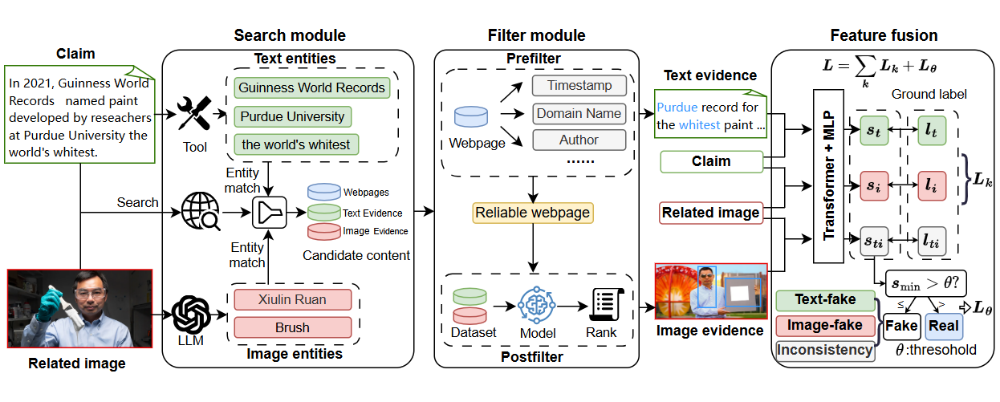

# SAF
This partial source code of SAF.


# Getting Started
Install torch=2.2 and diffusers for picture modification.
```c
pip install torch==2.2
pip install git+https://ghproxy.com/https://github.com/huggingface/diffusers
```
## Guidelines
- search.py is a search for evidence online.
- filter.py is to screen the evidence twice
- train.py is a training model file.
- Dataset_modify.py isto modify the text or picture of the data with a true label to make it false.

# Image 

